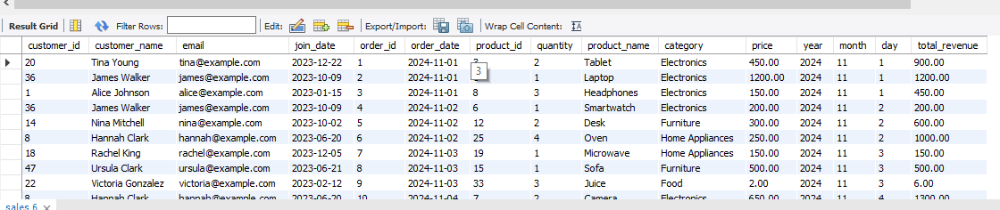
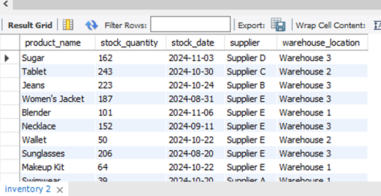

 ShopEase Data Engineering Project
 Overview
The ShopEase Data Engineering Project demonstrates advanced data engineering skills applied to real-world e-commerce sales data. The project is designed to help ShopEase, an e-commerce company, analyze their sales data for better business decision-making. The tasks cover key data engineering techniques using Python, SQL, and database optimization, including data loading, cleaning, manipulation, analysis, and integration with database operations like triggers and stored procedures.

Key Objectives
Python Data Engineering: Load, clean, transform, and analyze data using Pandas and NumPy.
SQL Mastery: Write complex queries with joins, subqueries, window functions, and CASE statements.
Database Optimization: Improve database performance using indexing, query optimization, and partitioning strategies.
Python and SQL Integration: Automate database operations with Python, including triggers and stored procedures.
Project Structure
Here’s the directory structure for this project:

graphql
Copy code
ShopEase-Data-Engineering/
│
├── ShopEase Data/              # Raw CSV data files (orders, products, customers, etc.)
│
├──  lab1.ipynb                 # Jupyter Notebooks for Python tasks (Lab 1)
│    
│
├──                        # SQL scripts for complex queries, optimizations, triggers
│    
├──  lab_exercise_2.sql
      lab_exercise_3.sql
│    lab_exercise_4.sql
│    lab_exercise_5.sql
│
└── ShopEase.pdf

Technologies Used
Python (Pandas, NumPy) for data manipulation, analysis, and transformation.
MySQL for database management and SQL querying.
SQL for writing complex queries, subqueries, and using window functions.
Jupyter Notebook for interactive Python development and data analysis.

##  DATA IN SQL DATABASE

### SUPPLIERS TABLE
Columns:
id, supplier_name, supplier_address, email, contact_number, fax, account_number, order_history, contract, supplier_country, supplier_city, country_code

### SALES TABLE
Columns:
Customer_id, customer_name, email, join_date, order_id, order_date, product_id, quantity, product_name, category, price, year, month, day, total_revenue

### PRODUCTS TABLE
Columns:
Product_id, product_name, category, price

### ORDERS TABLE
Columns:
order_id, customer_id, order_date, product_id, quantity

### ORDER_ITEMS TABLE
Columns:
order_detail_id, order_id, quantity, product_id

### CUSTOMERS TABLE
Columns:
Customer_id, customer_name, email, join_date

### INVENTORY TABLE
Columns:
product_name, stock_quantity, stock_date, supplier, warehouse_location

Screenshots of execution plans with explain

Returning an execution plan showing whether the database is performing a full table scan

Query Performance

